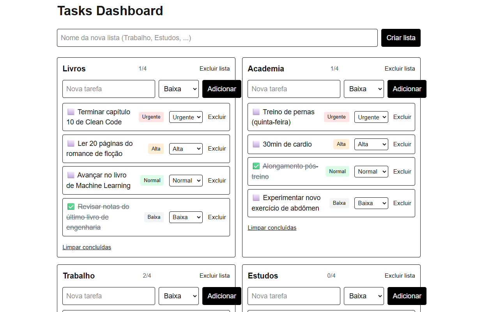

# Tasks Dashboard

Gerenciador de **múltiplas listas de tarefas** feito com **Next.js + React + TailwindCSS**.  
Cada tarefa tem **prioridade** (Urgente, Alta, Normal, Baixa) e as listas ficam **persistidas no navegador**.

https://github.com/frankstiwrx/tasks-dashboard-next

## ✨ Funcionalidades
- Criar, renomear e excluir **listas**
- Adicionar, marcar como concluída e excluir **tarefas**
- **Prioridades** por tarefa (Urgente/Alta/Normal/Baixa)
- **Ordenação automática**: mais prioritárias no topo; concluídas descem
- **Persistência** via `localStorage`
- Layout responsivo com **TailwindCSS**

## 🧰 Tecnologias
- Next.js (App Router) • React • TypeScript
- TailwindCSS

## 📸 Screenshots



## 🚀 Rodando localmente
```bash
# Node 18+ recomendado
npm install
npm run dev
# acesse http://localhost:3000
